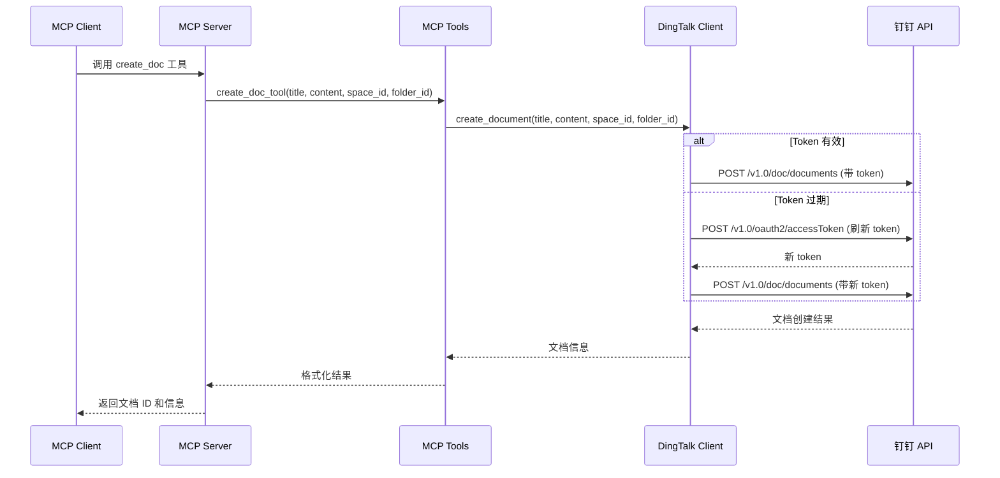
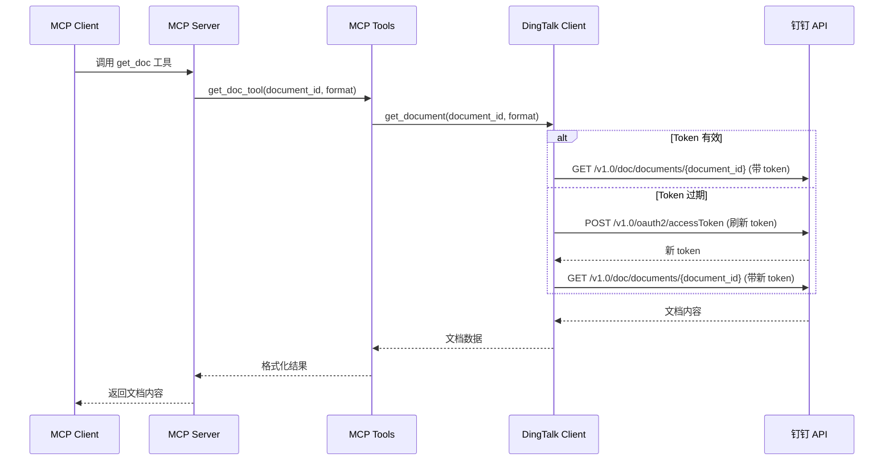
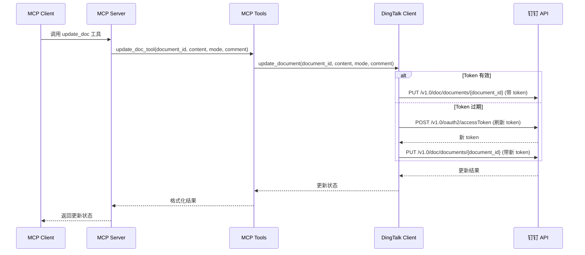
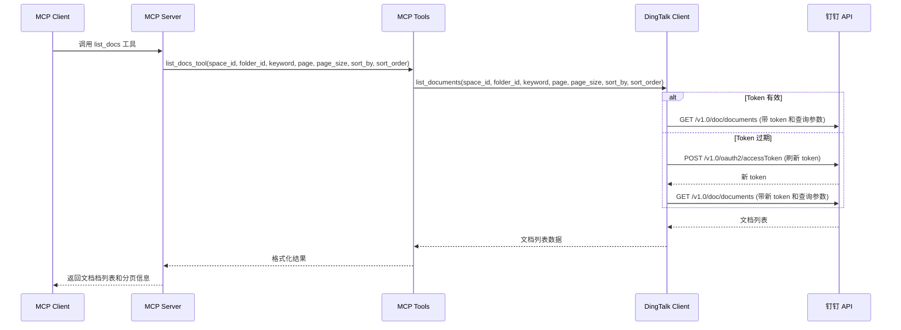

# 钉钉文档 MCP 服务架构与设计文档

## 一、背景与目标

### 1.1 背景
随着企业数字化转型的深入，钉钉作为企业协作平台的重要性日益凸显。钉钉文档作为钉钉生态中的重要组成部分，为企业提供了在线文档协作能力。为了更好地将钉钉文档能力与 AI 助手集成，我们需要构建一个基于 Anthropic MCP 协议的钉钉文档服务。

### 1.2 目标
本设计旨在实现一个遵循 Anthropic MCP 协议的钉钉文档服务，提供以下核心能力：
- 创建钉钉文档
- 根据文档 ID 读取文档内容
- 根据文档 ID 更新文档内容
- 列出当前用户/应用有权限访问的文档列表

该服务将作为 MCP Server 被客户端调用，支持基于钉钉开放平台"企业内部应用"的 AppKey/AppSecret 认证方式。

## 二、MCP 工具设计

### 2.1 工具列表概述

| 工具名称 | 功能描述 | 主要用途 |
|---------|---------|---------|
| create_doc | 创建钉钉文档 | 创建新的文档，可指定标题、关联空间等 |
| get_doc | 获取文档内容 | 根据文档 ID 读取文档的完整内容 |
| update_doc | 更新文档内容 | 根据文档 ID 更新文档内容，支持覆盖或追加模式 |
| list_docs | 列出可访问文档 | 获取当前用户/应用有权限访问的文档列表，支持分页和过滤 |

### 2.2 工具详细设计

#### 2.2.1 create_doc 工具

**功能描述**：创建新的钉钉文档

**参数结构**：
```json
{
  "title": {
    "type": "string",
    "description": "文档标题",
    "required": true
  },
  "content": {
    "type": "string",
    "description": "文档初始内容（可选）",
    "required": false
  },
  "space_id": {
    "type": "string",
    "description": "关联的空间 ID（可选）",
    "required": false
  },
  "folder_id": {
    "type": "string",
    "description": "关联的文件夹 ID（可选）",
    "required": false
  }
}
```

**返回值结构**：
```json
{
  "success": {
    "type": "boolean",
    "description": "操作是否成功"
  },
  "document_id": {
    "type": "string",
    "description": "创建的文档 ID"
  },
  "title": {
    "type": "string",
    "description": "文档标题"
  },
  "create_time": {
    "type": "string",
    "description": "创建时间"
  },
  "url": {
    "type": "string",
    "description": "文档访问链接"
  }
}
```

**错误处理**：
- 认证失败：返回 `{"error": "Authentication failed", "code": "AUTH_ERROR"}`
- 权限不足：返回 `{"error": "Insufficient permissions", "code": "PERMISSION_DENIED"}`
- 参数错误：返回 `{"error": "Invalid parameters", "code": "INVALID_PARAMS", "details": "..."}`
- 钉钉接口错误：返回 `{"error": "DingTalk API error", "code": "DINGTALK_ERROR", "details": "..."}`

#### 2.2.2 get_doc 工具

**功能描述**：根据文档 ID 获取文档内容

**参数结构**：
```json
{
  "document_id": {
    "type": "string",
    "description": "文档 ID",
    "required": true
  },
  "format": {
    "type": "string",
    "description": "返回格式（text/markdown/html，默认为 text）",
    "required": false,
    "default": "text"
  }
}
```

**返回值结构**：
```json
{
  "success": {
    "type": "boolean",
    "description": "操作是否成功"
  },
  "document_id": {
    "type": "string",
    "description": "文档 ID"
  },
  "title": {
    "type": "string",
    "description": "文档标题"
  },
  "content": {
    "type": "string",
    "description": "文档内容"
  },
  "format": {
    "type": "string",
    "description": "内容格式"
  },
  "update_time": {
    "type": "string",
    "description": "最后更新时间"
  },
  "author": {
    "type": "string",
    "description": "文档作者"
  }
}
```

**错误处理**：
- 文档不存在：返回 `{"error": "Document not found", "code": "NOT_FOUND"}`
- 认证失败：返回 `{"error": "Authentication failed", "code": "AUTH_ERROR"}`
- 权限不足：返回 `{"error": "Insufficient permissions", "code": "PERMISSION_DENIED"}`
- 钉钉接口错误：返回 `{"error": "DingTalk API error", "code": "DINGTALK_ERROR", "details": "..."}`

#### 2.2.3 update_doc 工具

**功能描述**：根据文档 ID 更新文档内容

**参数结构**：
```json
{
  "document_id": {
    "type": "string",
    "description": "文档 ID",
    "required": true
  },
  "content": {
    "type": "string",
    "description": "要更新的内容",
    "required": true
  },
  "mode": {
    "type": "string",
    "description": "更新模式（overwrite/append，默认为 overwrite）",
    "required": false,
    "default": "overwrite"
  },
  "comment": {
    "type": "string",
    "description": "更新备注（可选）",
    "required": false
  }
}
```

**返回值结构**：
```json
{
  "success": {
    "type": "boolean",
    "description": "操作是否成功"
  },
  "document_id": {
    "type": "string",
    "description": "文档 ID"
  },
  "update_time": {
    "type": "string",
    "description": "更新时间"
  },
  "version": {
    "type": "integer",
    "description": "文档版本号"
  }
}
```

**错误处理**：
- 文档不存在：返回 `{"error": "Document not found", "code": "NOT_FOUND"}`
- 认证失败：返回 `{"error": "Authentication failed", "code": "AUTH_ERROR"}`
- 权限不足：返回 `{"error": "Insufficient permissions", "code": "PERMISSION_DENIED"}`
- 内容冲突：返回 `{"error": "Content conflict", "code": "CONFLICT_ERROR"}`
- 钉钉接口错误：返回 `{"error": "DingTalk API error", "code": "DINGTALK_ERROR", "details": "..."}`

#### 2.2.4 list_docs 工具

**功能描述**：列出当前用户/应用有权限访问的文档列表

**参数结构**：
```json
{
  "space_id": {
    "type": "string",
    "description": "空间 ID（可选，用于过滤特定空间的文档）",
    "required": false
  },
  "folder_id": {
    "type": "string",
    "description": "文件夹 ID（可选，用于过滤特定文件夹的文档）",
    "required": false
  },
  "keyword": {
    "type": "string",
    "description": "搜索关键词（可选，用于标题和内容搜索）",
    "required": false
  },
  "page": {
    "type": "integer",
    "description": "页码（从 1 开始，默认为 1）",
    "required": false,
    "default": 1
  },
  "page_size": {
    "type": "integer",
    "description": "每页数量（默认为 20，最大 100）",
    "required": false,
    "default": 20
  },
  "sort_by": {
    "type": "string",
    "description": "排序字段（create_time/update_time/title，默认为 update_time）",
    "required": false,
    "default": "update_time"
  },
  "sort_order": {
    "type": "string",
    "description": "排序顺序（asc/desc，默认为 desc）",
    "required": false,
    "default": "desc"
  }
}
```

**返回值结构**：
```json
{
  "success": {
    "type": "boolean",
    "description": "操作是否成功"
  },
  "documents": {
    "type": "array",
    "description": "文档列表",
    "items": {
      "document_id": {
        "type": "string",
        "description": "文档 ID"
      },
      "title": {
        "type": "string",
        "description": "文档标题"
      },
      "summary": {
        "type": "string",
        "description": "文档摘要"
      },
      "create_time": {
        "type": "string",
        "description": "创建时间"
      },
      "update_time": {
        "type": "string",
        "description": "更新时间"
      },
      "author": {
        "type": "string",
        "description": "文档作者"
      },
      "space_id": {
        "type": "string",
        "description": "所属空间 ID"
      },
      "folder_id": {
        "type": "string",
        "description": "所属文件夹 ID"
      }
    }
  },
  "pagination": {
    "page": {
      "type": "integer",
      "description": "当前页码"
    },
    "page_size": {
      "type": "integer",
      "description": "每页数量"
    },
    "total": {
      "type": "integer",
      "description": "总数量"
    },
    "total_pages": {
      "type": "integer",
      "description": "总页数"
    }
  }
}
```

**错误处理**：
- 认证失败：返回 `{"error": "Authentication failed", "code": "AUTH_ERROR"}`
- 权限不足：返回 `{"error": "Insufficient permissions", "code": "PERMISSION_DENIED"}`
- 参数错误：返回 `{"error": "Invalid parameters", "code": "INVALID_PARAMS", "details": "..."}`
- 钉钉接口错误：返回 `{"error": "DingTalk API error", "code": "DINGTALK_ERROR", "details": "..."}`

## 三、钉钉 API 和认证设计

### 3.1 钉钉开放平台 API 设计

#### 3.1.1 认证相关 API

**获取 access_token 接口**：
- 接口类型：企业内部应用认证
- 请求方式：GET
- 接口地址：`/v1.0/oauth2/accessToken`
- 请求参数：
  ```json
  {
    "appKey": "应用 AppKey",
    "appSecret": "应用 AppSecret"
  }
  ```
- 返回结果：
  ```json
  {
    "accessToken": "访问令牌",
    "expireIn": 7200,
    "refreshToken": "刷新令牌"
  }
  ```

#### 3.1.2 文档管理 API

**创建文档接口**：
- 接口类型：文档管理
- 请求方式：POST
- 接口地址：`/v1.0/doc/documents`
- 请求参数：
  ```json
  {
    "spaceId": "空间 ID",
    "folderId": "文件夹 ID",
    "title": "文档标题",
    "content": "文档内容",
    "format": "文档格式"
  }
  ```

**获取文档内容接口**：
- 接口类型：文档管理
- 请求方式：GET
- 接口地址：`/v1.0/doc/documents/{documentId}`
- 请求参数：
  ```json
  {
    "format": "返回格式"
  }
  ```

**更新文档内容接口**：
- 接口类型：文档管理
- 请求方式：PUT
- 接口地址：`/v1.0/doc/documents/{documentId}`
- 请求参数：
  ```json
  {
    "content": "更新内容",
    "mode": "更新模式",
    "comment": "更新备注"
  }
  ```

**查询文档列表接口**：
- 接口类型：文档管理
- 请求方式：GET
- 接口地址：`/v1.0/doc/documents`
- 请求参数：
  ```json
  {
    "spaceId": "空间 ID",
    "folderId": "文件夹 ID",
    "keyword": "搜索关键词",
    "page": "页码",
    "pageSize": "每页数量",
    "sortBy": "排序字段",
    "sortOrder": "排序顺序"
  }
  ```

### 3.2 环境变量配置

**必需环境变量**：
- `DINGTALK_APP_KEY`：钉钉企业内部应用的 AppKey
- `DINGTALK_APP_SECRET`：钉钉企业内部应用的 AppSecret

**可选环境变量**：
- `DINGTALK_TENANT_ID`：租户 ID（如需要）
- `DINGTALK_BASE_URL`：钉钉 API 基础 URL（默认为 `https://api.dingtalk.com`）
- `DINGTALK_TOKEN_CACHE_TTL`：access_token 缓存时间（秒，默认为 3600）

### 3.3 Access Token 管理策略

#### 3.3.1 Token 获取与缓存
- **首次获取**：服务启动时，使用 AppKey 和 AppSecret 向钉钉开放平台请求 access_token
- **缓存机制**：将获取的 access_token 存储在内存中，并设置过期时间（通常为 7200 秒）
- **提前刷新**：在 token 过期前 5 分钟自动刷新，避免服务中断

#### 3.3.2 Token 刷新策略
- **自动刷新**：后台定时检查 token 有效期，在即将过期时自动刷新
- **失败重试**：如果刷新失败，采用指数退避策略进行重试（1s, 2s, 4s, 8s, 16s）
- **降级处理**：连续刷新失败超过 5 次后，记录错误日志并暂停自动刷新，等待手动干预

#### 3.3.3 错误处理
- **认证失败**：检查 AppKey 和 AppSecret 是否正确，网络连接是否正常
- **权限不足**：确认应用是否有足够的权限访问文档 API
- **频率限制**：遇到 API 调用频率限制时，自动等待并重试

## 四、项目结构与模块职责

### 4.1 项目文件结构

```
aggr_force/
├── dingtalk_mcp_server.py      # MCP Server 入口文件
├── dingtalk_client.py          # 钉钉开放平台 API 客户端
├── mcp_tools.py                # MCP 工具实现
├── config.py                   # 配置管理
├── README_DINGTALK_MCP.md      # 使用说明文档
└── DingTalk_MCP_Design.md      # 本设计文档
```

### 4.2 模块职责说明

#### 4.2.1 dingtalk_mcp_server.py
**职责**：MCP Server 的入口文件，负责服务启动和工具注册

**主要功能**：
- 初始化 FastMCP 服务器实例
- 注册所有 MCP 工具
- 配置服务器参数（名称、版本等）
- 启动服务器事件循环

**伪代码示例**：
```python
from mcp.server.fastmcp import FastMCP
from mcp_tools import create_doc_tool, get_doc_tool, update_doc_tool, list_docs_tool

# 初始化 MCP Server
mcp = FastMCP("DingTalk-Doc-MCP-Server")

# 注册工具
mcp.tool()(create_doc_tool)
mcp.tool()(get_doc_tool)
mcp.tool()(update_doc_tool)
mcp.tool()(list_docs_tool)

# 启动服务器
if __name__ == "__main__":
    mcp.run()
```

#### 4.2.2 dingtalk_client.py
**职责**：封装钉钉开放平台 API 调用，处理认证和错误

**主要功能**：
- 管理 access_token 的获取和刷新
- 封装钉钉文档相关 API 调用
- 处理 API 调用错误和重试逻辑
- 提供统一的接口给 MCP 工具使用

**主要类和方法**：
- `DingTalkClient`：主客户端类
  - `__init__()`：初始化客户端，加载配置
  - `get_access_token()`：获取 access_token
  - `refresh_access_token()`：刷新 access_token
  - `create_document()`：创建文档
  - `get_document()`：获取文档内容
  - `update_document()`：更新文档内容
  - `list_documents()`：查询文档列表

#### 4.2.3 mcp_tools.py
**职责**：实现 MCP 工具，将钉钉客户端功能映射为 MCP 工具

**主要功能**：
- 实现 create_doc_tool 工具
- 实现 get_doc_tool 工具
- 实现 update_doc_tool 工具
- 实现 list_docs_tool 工具
- 处理工具参数验证和错误转换

**主要函数**：
- `create_doc_tool(title, content=None, space_id=None, folder_id=None)`：创建文档工具
- `get_doc_tool(document_id, format="text")`：获取文档工具
- `update_doc_tool(document_id, content, mode="overwrite", comment=None)`：更新文档工具
- `list_docs_tool(space_id=None, folder_id=None, keyword=None, page=1, page_size=20, sort_by="update_time", sort_order="desc")`：列出文档工具

#### 4.2.4 config.py
**职责**：读取和验证环境变量配置

**主要功能**：
- 从环境变量读取配置
- 验证必需的配置项
- 提供默认值
- 配置验证和错误提示

**主要类和方法**：
- `Config`：配置类
  - `__init__()`：初始化配置
  - `validate()`：验证配置有效性
  - `get_dingtalk_config()`：获取钉钉相关配置
  - `get_server_config()`：获取服务器相关配置

### 4.3 模块间调用关系

```
┌─────────────────────────┐    ┌──────────────────┐    ┌─────────────────┐
│   dingtalk_mcp_server   │───▶│    mcp_tools     │───▶│ dingtalk_client  │
└─────────────────────────┘    └──────────────────┘    └─────────────────┘
                                        │                        │
                                        ▼                        ▼
                                ┌──────────────────┐    ┌─────────────────┐
                                │      config      │    │  钉钉开放平台 API │
                                └──────────────────┘    └─────────────────┘
```

## 五、典型调用流程

### 5.1 创建文档流程



### 5.2 获取文档流程



### 5.3 更新文档流程



### 5.4 列出文档流程



## 六、未来可扩展方向

### 6.1 功能扩展

#### 6.1.1 文档管理增强
- **删除文档**：添加删除文档的工具，支持软删除和硬删除
- **文档权限管理**：管理文档的访问权限，支持用户和角色授权
- **文档版本管理**：查看文档历史版本，支持版本回滚
- **文档协作**：支持文档评论、@提及、协作编辑等功能

#### 6.1.2 文档内容处理
- **文档格式转换**：支持不同格式之间的转换（Markdown、HTML、Word 等）
- **文档内容分析**：提取文档关键信息、生成摘要、关键词提取
- **文档模板**：支持基于模板创建文档，提供常用文档模板库
- **批量操作**：支持批量创建、更新、删除文档

#### 6.1.3 集成能力增强
- **与其他钉钉服务集成**：与钉钉审批、日程、任务等服务集成
- **第三方服务集成**：与云存储、邮件、日历等服务集成
- **Webhook 支持**：支持文档变更事件的通知
- **数据同步**：支持与其他文档平台的数据同步

### 6.2 技术优化

#### 6.2.1 性能优化
- **缓存策略**：实现更智能的缓存机制，减少 API 调用
- **并发处理**：支持并发请求处理，提高服务响应速度
- **连接池**：使用 HTTP 连接池优化网络请求
- **异步处理**：将部分操作改为异步处理，提高用户体验

#### 6.2.2 可靠性提升
- **重试机制**：完善的重试策略，处理网络波动和临时故障
- **熔断机制**：在钉钉 API 不可用时自动熔断，避免级联故障
- **监控告警**：添加服务监控和告警机制
- **日志追踪**：完善日志记录，支持请求链路追踪

#### 6.2.3 安全性增强
- **访问控制**：更细粒度的访问控制和权限管理
- **数据加密**：敏感数据的加密存储和传输
- **审计日志**：完整的操作审计日志
- **安全扫描**：定期的安全漏洞扫描和修复

### 6.3 用户体验优化

#### 6.3.1 工具易用性
- **智能提示**：提供更智能的参数提示和错误提示
- **批量操作**：支持批量文档操作，提高效率
- **快捷操作**：提供常用操作的快捷方式
- **个性化配置**：支持用户个性化配置和偏好设置

#### 6.3.2 开发者体验
- **SDK 提供**：提供多语言 SDK，方便集成
- **文档完善**：提供详细的开发文档和示例代码
- **调试工具**：提供调试工具和测试环境
- **社区支持**：建立开发者社区，提供技术支持

### 6.4 商业化考虑

#### 6.4.1 多租户支持
- **租户隔离**：支持多租户架构，确保数据隔离
- **资源配额**：支持租户资源配额管理
- **计费模式**：支持多种计费模式和套餐选择

#### 6.4.2 企业级特性
- **企业集成**：支持与企业现有系统的深度集成
- **合规认证**：支持各种合规认证要求
- **私有部署**：支持私有化部署方案
- **定制开发**：支持企业定制开发需求

## 七、总结

本设计文档详细描述了基于 Anthropic MCP 协议的钉钉文档服务的架构设计。通过模块化的设计和清晰的职责划分，该服务能够稳定、高效地为用户提供钉钉文档的创建、读取、更新和列表功能。同时，设计考虑了未来的扩展性，为后续的功能增强和技术优化提供了良好的基础。

该设计遵循了 MCP 协议的标准，确保了与各种 MCP 客户端的兼容性。通过完善的错误处理、认证机制和缓存策略，保证了服务的可靠性和性能。未来可以根据实际需求和技术发展，逐步实现更多的功能扩展和技术优化。